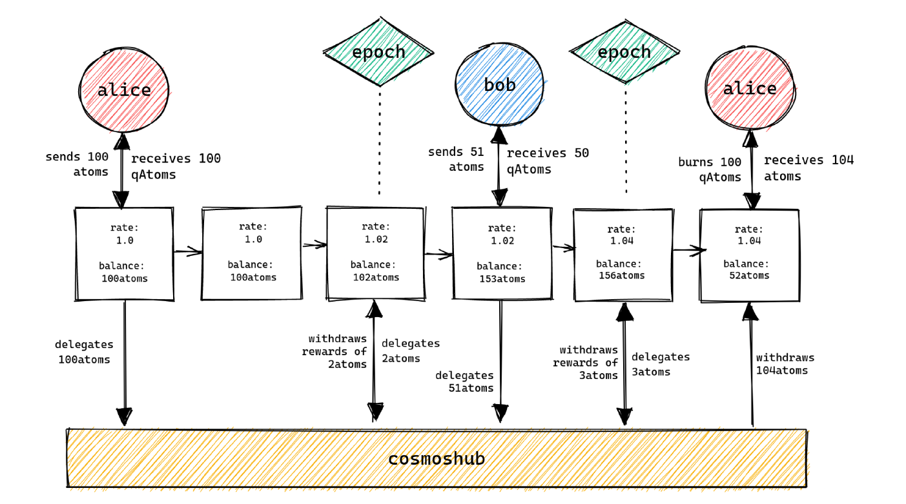
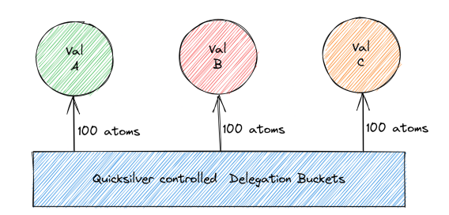
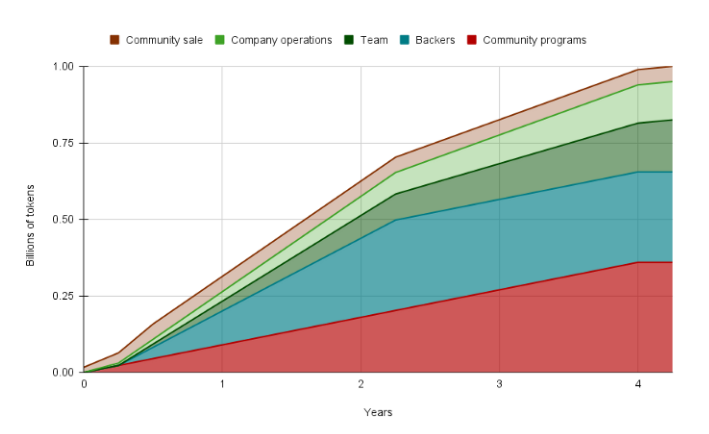

# Axelar Network

## Axelar Network

Axelar is a universal overlay network connecting all blockchain ecosystems, applications and assets to provide Web3 interoperability. In simple terms, Axelar serves as an intermediary for interoperability between different networks.

The main goals of Axelar:

\- Give blockchain developers the ability to easily plug in to Axelar and interact with other blockchains

\- Provide decentralized applications developers with cross-chain composability

\- Allow users to easily and conveniently interact with decentralized applications on various platforms.

<figure><figcaption></figcaption></figure>

The Axelar network consists of three main components operating at two functional levels (network level and smart contract level):

1\. A decentralized network that is responsible for transactions and maintain by a set of validators

2\. Gateways are smart contracts that provide connectivity between Axelar Network and any other Layer 1 blockchain. Gateways can operate on top of any L1 blockchain. Validators monitor gateways for incoming requests via the READ function, and then vote for the transaction (it is discussed further below) and send the transaction to the destination network gateway - the WRITE function

3\. APIs and SDKs, available to developers, allow them to easily make their blockchains and applications compatible with Axelar, so they can do any cross-chain interaction between any blockchains

### **Validators**

A set of validators is formed in a permissionless way, meaning that every user who meets certain selection criteria can be a validator.&#x20;

Axelar validators play two key roles. The first one is pretty standart – they take part in consensus, produce blocks and validate transactions. And the second one is that validators must verify all cross-chain operations processed on the Axelar network. So they must run a light client or full node for at least one external network to observe its state changes (or states if multiple networks are involved). Each validator can run as many nodes for supported chains as he wants, but the more chains they observe the more rewards they have, so validators are incentivized to run nodes for as many supported chains as possible.

### **How it works**

A user wants to send tokens from network A to network B. To do this he deposits tokens to a deposit address in network A and waits for the Axelar network to validate this deposit. Axelar validators running nodes (or light clients) in network A check if the user actually made the deposit, vote for or against the transfer. If there is a required number of votes, Axelar confirms the transaction. Then if the receiving network B has an Axelar gateway, the transferred tokens are mined by the Gateway smart contract and sent to the deposit address in network B. Each Gateway smart contract is controlled by a private key. Every transaction should be signed with this key to be processed. Each validator has a piece of this key called a key share. So, to sign the transaction, validators must vote to reach a consensus again. If the consensus is reached, the token is sent to the deposit address in network B, and the token transfer process ends there. This algorithm is used not only for token transfers but also for any messaging between networks.

Graphically the whole process is shown in the figure (green arrows show the algorithm for checking the validity of the transaction, purple - the path through which the message goes from network A to network B).

#### **Сonsensus mechanism**

The consensus voting process combines a PoS mechanism and a threshold signature scheme (TSS). Similar to multisig, TSS requires a certain minimum number of validator signatures to approve a request. The key difference of the TSS model is that to form a single signature the private keys are assembled before signing. During rotation of validators and formation of a new set of validators new private keys are generated and distributed to generate a new TSS signature. It provides additional protection against a possible attack on the system, but also adds additional risks associated with the TSS generation process. The minimum threshold (\*minimum number of validator signatures) for approving a messaging request is variable and depends on the receiving network. This approach allows each inter-chain connection to have unique security parameters.

#### **Gateways**

Gateway smart contracts allow messages to be sent between any networks connected to Axelar. Each EVM compatible network has its own separate gateway and each gateway is controlled by its own private key, as explained above.

#### **Relayers**

Why Axelar uses relayers is better to explain by a practical example. In the example above, when a user initiates a token transfer from network A to network B, he first generates a deposit address associated with that transaction on network A and sends the number of tokens he wants to transfer to network B. The relayers send a request to the validator to verify this address and vote on the validity of the transaction. Without relayers validators would not know which addresses to verify. Users can perform cross-chain transfers through the Satelite app. At the moment only a beta version is available, and the app supports a small set of networks. To find out more about Satelite click [here](https://satellite.money/).&#x20;

<figure><figcaption></figcaption></figure>

It’s also important to understand that Axelar stores only information related to gateway smart contracts and cross-chain transactions (it does not store a full registry of network states involved in the inter-chain message exchange via Axelar).

### AXL Tokenomics

AXL is the native token of the Axelar Network. AXL supports four functions:

AXL is a medium for transaction fees and any other fees for network usage, paid by users to the validators that run the network AXL is used by holders and their trustees to stake and vote on governance proposals (such as a parameter change or protocol upgrade) AXL enables incentives to support the decentralized Proof-of-Stake consensus that secures the network and validates transactions on chain. Validators receive AXL rewards as incentives to continue to secure the network. These rewards are distributed programmatically, per rules encoded in network protocols, and are inflationary, i.e., each protocol reward increases the total token supply AXL is used to reward ecosystem builders and community contributors

#### **Token economics**

The token economics for AXL are geared towards the creation of a token economy that supports Axelar network in achieving the following key outcomes:&#x20;

* Security. A proper incentives model with healthy staking rewards that encourages a wide validator set to operate secure nodes.&#x20;
* Decentralization. A token distributed across a wide set of holders who will delegate to a decentralized set of validators and contribute to governance decisions.&#x20;
* Longevity. The token economics are designed to encourage general maintenance of all critical Axelar-related processes (such as block validation).&#x20;
* Ecosystem growth. The token incentivizes dApp builders to use Axelar APIs for cross-chain development.

The excess liquidity from each payment taking place on the axelar can be harnessed

🔥Returned to the users

&#x20;🔥Used to buy back $AXL tokens&#x20;

🔥Burn AXL tokens

This could be a virtuous cycle if implemented.

Volume ➡ Fees ➡ Excess ➡ $AXL token value

#### AXL Genesis

At the Axelar genesis block, 1 billion AXL tokens in total will be issued and allocated to the following interested parties and programs:

* Team and community managers
* Company: Axelar Inc. operational treasury and future employee incentives
* Backers: Seed, Series A and Series B investorsBackers: Seed, Series A and Series B investors
* Community sale: A public sale that will happen after mainnet launch, with the objective of distributing tokens to multiple members of the community
* Community programs: testnet/dashboard/wallet/developer grants, liquidity rewards and other incentive programs, managed by the [Axelar Foundation](http://axelar.foundation/). At least 5% of the total supply will be set aside from Community programs, to be allocated towards an insurance fund and insurance programs

**AXL token allocations at genesis**

<figure><figcaption></figcaption></figure>

Company: 29.5%.&#x20;

– Core team: 17%

– Company operations: 12.5%&#x20;

Backers: 29.54%&#x20;

– Seed: 13.4%

– Series A: 12.64%

&#x20;– Series B: 3.5%

<figure><figcaption></figcaption></figure>

Community sale: 5%

Community programs (including the insurance fund): 35.96%

#### Unlocking in the Axelar Network

<figure><figcaption>
Token release schedule 
</figcaption></figure>

#### Token release schedule&#x20;

<figure><figcaption></figcaption></figure>

Transaction fees, rewards and inflation for AXL token is described [here](https://medium.com/@axelar-foundation/inflation-and-transaction-fees-on-the-axelar-network-d56ea9e2c142).

_The token release took place on September 27, 2022._

_\*Axelar Foundation aims to spend community tokens according to release schedule. However, does not exclude the possibility of spending tokens ahead of schedule, as needed (for example, by transferring tokens to a community governance pool). On day 1, from 2 million to 3.5 million tokens will be loaned to market makers and circulated, in order to provide liquidity_

_\*\*On Day 1, 1/3 of community-sale tokens will be released. The remaining tokens will release linearly over the following four months._

_\*\* The release schedule for the core team and backers begins three months after Day 1_

### Opportunities and risks

So how successful has @axelarcore been since their launch this year?

Here's some metrics:

⛓ 2nd Largest by IBC volume&#x20;

⛓ $204M transferred over 30 Days&#x20;

⛓ 7274 Monthly Average Users&#x20;

⛓ $127M in TVL

<figure><figcaption></figcaption></figure>

Where is the money flowing?

@axelarcore has been the largest provider of $USDC liquidity in the Cosmos.

Out of the $127.0M in TVL, 53% it comes from $USDC volume.

<figure><figcaption></figcaption></figure>

Read more about Axelar's results for the first 6 months [here](https://twitter.com/Flowslikeosmo/status/1582174643900715008?s=20\&t=qjR-Xluj5LTf9\_lz9c4ujw).

You can say that Axelar is like the brain for all heterogeneous blockchain networks. It can both read and write functions, aggregates various indeterminate inputs and uses them to calculate a single deterministic output which is a simple yes/no function. The network boasts an impressive set of offerings that will make it attractive to developers as a base for cross-chain applications.

\- Built-in IBC support provides the growing Cosmos ecosystem with another solution for interacting with networks which have no instant finality consensus mechanism

\- TSS allows to configure an individual minimum consensus threshold for each network

\- The hub-and-spoke model allows the number of networks in the system to increase linearly with the number of connections needed to connect them. And in a world where the number of different blockchains is growing rapidly this approach has a huge advantage over pairwise connections (\*pairwise connections mean that every two separate networks are connected with each other by bidirectional channel and no hub is used)&#x20;

In the short term Axelar's biggest drawback is their PoS-based economic security model. If Axelar has fewer funds locked up than the networks it serves, there is an incentive for attack for bad actors. However, since Axelar is built on the Cosmos SDK this disadvantage may be mitigated with the soon-to-be-introduced Cosmos ecosystem interchain security model (sometimes called "shared security").

### **Long-term risks**

1\) If a bad actor gains control of 2/3 of all validators he will be able to control Axelar, and send any requests to all connected networks

2\) If 1/3 of Axelar validators (validators who have 1/3 of all staked coins) go offline, then other networks will suffer. The inter-chain messaging between them will not be possible

So, If Axelar succeeds, there will be another potential, but unlikely possible, "black swan” in the crypto world

### **Links**

Axelar official [website](https://axelar.network/)

&#x20;Axelar official [blog](https://axelar.network/blog)&#x20;

[Whitepaper](https://axelar.network/wp-content/uploads/2021/07/axelar\_whitepaper.pdf) (lots of technical details about Axelar)&#x20;

[Article](https://0xpostman.medium.com/part-2-cross-chain-security-models-compared-c4f91107cad4) about cross-chain model comparison by 0xpostman&#x20;
