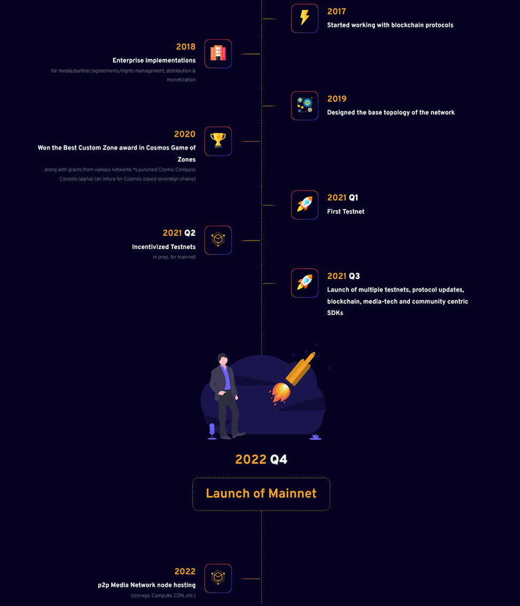

# Omniflix

## Omniflix 

OmniFlix Network (formerly known as FreeFlexMedia Network) – is a p2p network for creators and communities that allows to achieve efficiency in management, distribution and monetization of user-generated content.

The network was designed to solve the following problems:

* Low audience reach&#x20;
* Lack of tools for cooperation in content creating and its distribution and monetization
* Insufficiently sovereign infrastructure

The team emphasizes that OmniFlix is not an app or a platform, it is a network. At the same time, since OmniFlix implements the existing set of protocols, it is not a protocol itself. However, OmniFlix can develop required protocols that might be missing.

OmniFlix network uses three types of nodes: 1) Validator 2) Relayer 3) Storage. Validator is responsible for block production and governance (on behalf of delegators), relayer moves packets from one chain to another, and storage delivers content within the network.

Despite the fact that the mainnet launch is scheduled for Q4, 2022, you can already try OmniFlix by yourself and even buy some NFTs.

<figure><figcaption></figcaption></figure>

At the moment the ecosystem consists of four components: OmniFlix Studio, OmniFlix Market, OmniFlixin Sync and StreamPay. **OmniFlix Studio** is an app that allows to create, mint, manage, distribute and monetize content. **OmniFlix Market** is used to list NFTs, collect and transfer tokens (including IBC transfers). You can see a good example of multi-chain power on the screenshot below. Initially, CryptoGopniks are minted on Cosmos Hub ( by the way, they cost 2.28 ATOM).&#x20;

<figure><figcaption></figcaption></figure>

One of the remarkable chain's dApp is one of the HackAtom IV participants, **StreamPay**. StreamPay is a streaming payments service for Cosmos-based chains. Its module is similar to CosmWasm. The service has its own token — SPAY, but other IBC tokens, for instance, FLIX and JUNOX, are also supported.

The general idea is this: Supposing, Potap wants to pay for Lilian's service and set aside 100 SPAY for that purpose. Potap selects Lili's wallet as a recipient address, and then sets start and end time for the service. During that time payment will be evenly distributed to blocks.

The service is crude for now, but StreamPay plans to implement stop payments, on-chain triggers at start/end, adaptive adjustment of the payment share, etc.

### Token & tokenomics (more [here](https://mirror.xyz/omniflixnetwork.eth/ofhbzvUBx5WjrrGyNWHSnGYFDA3NtnmIGko16cxYG4M))

**FLIX** is the native token that powers and secures the OmniFlix Hub and below is a primer to understand the role of **FLIX** as a part of the OmniFlix Hub.

<figure><figcaption></figcaption></figure>

* Total Supply - 1 Billion **FLIX**
* Genesis Supply - 300 Million **FLIX**
* Time to reach maximum supply of 1B **FLIX** is **7 years** with inflation starting at \~33% and tapering to \~11%
* This leads to the minting of \~100M **FLIX** every year until the end of the 7th year
* Inflation rewards are distributed to the Community Pool and covers various stakeholders with budgets for security, adoption, technical and infrastructure.

#### Genesis Supply

The genesis supply of 300M **FLIX** is broken down into 3 equal parts of 100M **FLIX** each.

<figure><figcaption>
Breakdown of the genesis supply
</figcaption></figure>

<figure><figcaption>
Vesting schedule of the genesis supply of 300M FLIX
</figcaption></figure>

#### Inflation Distribution

Inflation is distributed to align incentives towards the stakeholders that participate in the growth of the network.

Here’s a visualization of the breakdown of 100% of the inflation. This has been updated to its final state after our discussion with our validators, advisors, early contributors and others.

<figure><figcaption>
Inflation distribution across stakeholders that push forward the network
</figcaption></figure>

Below is the breakdown of the tokens that are minted as a result of in-protocol inflation.

* Inflation at \~33% and tapers to \~11% by year 7
*   Inflation is distributed to various stakeholders, including:

    * **60% - Security Budget** allocated for Stakers/Delegators who delegate their voting power and secure the chain - 60% (or 420M FLIX at the end of 7yrs).
    * **15% - Adoption Budget** allocated towards grants for Creators/Collectors/Curators/Publishers/Communities - for increasing transactional and economic activity on the network - 15% (105M FLIX at the end of 7yrs), managed by the subDAO.
    * **15% - Development Budget** allocated towards Developer Grants for building the infrastructure to increase adoption - 15% (or 105M FLIX at the end of 7yrs), managed by the subDAO
    * **5% - Infrastructure Budget** allocated towards Node Hosts for nodes without in-protocol incentivization like Relayers & Media Node hosts - 5% (or 35M FLIX at the end of 7yrs)
    * **5% - Community Pool** for funding activities at the discretion of the community of delegators - 5% (or 35M FLIX at the end of 7yrs).

    ## Utility of the FLIX token

    #### &#x20;       Delegation for Chain Security & Governance Participation

    1. FLIX token holders govern the OmniFlix Hub and the chains secured via shared security mechanisms like Replicated, Mesh, Alliance or others in the future.
    2. Staked FLIX tokens represent voting power. Delegate voting power to node hosts (validators) to secure the network and to participate in the governance process.
    3. Delegators of FLIX receive a portion of the in-protocol fee generate

    #### &#x20;        Fees

    **a) Gas Fee**

    1. FLIX will be used as the gas fee and as the transaction fee on the OmniFlix Hub.
    2. In the future, we might have validators accepting other tokens as gas fee. In that case, the gas fees received will be swapped to FLIX via an Osmosis outpost or any other mechanism involved.

    **b) Transaction Fees** (from in-protocol interactions)

    1. On the OmniFlix Hub, certain interactions will need the user to pay a Transaction Fee to the network for interacting with the protocol.
    2. An example of this would be the fee paid for as a part of the interactions with the `marketplace module`.
    3. A portion of this ‘in-protocol fee’ will be directed towards various stakeholders including delegators of FLIX token and/or to the Community Pool.
    4. Stakeholders for certain transactions include developers, creators and others. This is primarily due to the nature of the economic activity and will be determined on a case to case basis with community consensus.
    5. Note that IBC tokens can be used on the network for certain types of transactions like in the `marketplace` module for NFT listing (fixed price or auctions). FLIX holders receive a discount or any token that is not the native token of the network (FLIX) will incur a premium for their use within the OmniFlix Network.

    #### &#x20;            Media Infrastructure Marketplace

    1. With the rise of AI-generated content and the rise of heavy workloads, media infrastructure for public goods plays a key role and especially within the OmniFlix ecosystem.
    2. FLIX token will be used for payment of infrastructure services for _Media Node Hosts_ that maintain origin storage, encoding & transcoding or delivery nodes.
    3. Media Nodes are being planned right now and details will be shared subsequently in Q3 of 2023.
    4. This infrastructure will be utilized by Events (like [Cosmoverse](https://cosmoverse.omniflix.co/), [AwesomWasm](https://tickets.awesomwasm.com/buyTickets), [Nebular Summit](https://tickets.nebular.builders/) & more) and publishers like Akash Network, running the [AkashEDU](https://akashedu.omniflix.tv/) program (with an NFT-gated video course) fully powered by OmniFlix’s infrastructure. It will also power the creators of NFTs on the OmniFlix Network without having to rely on external storage services.

### Links

* Telegram - [https://t.me/OmniFlixNetwork](https://t.me/OmniFlixNetwork)
* Telegram Chat - [https://t.me/OmniFlixChat](https://t.me/OmniFlixChat)
* Discord - [https://discord.com/invite/6gdQ4yZSTC](https://discord.com/invite/6gdQ4yZSTC)
* Twitter - [https://twitter.com/OmniFlixNetwork](https://twitter.com/OmniFlixNetwork)
* Reddit - [https://www.reddit.com/r/OmniFlix/](https://www.reddit.com/r/omniflix/)
* Medium (for blog posts until June 2022) - [https://medium.com/@OmniFlix](https://medium.com/@OmniFlix)
* Blog (for posts from July 2022) - [https://mirror.xyz/OmniFlixNetwork.eth](https://mirror.xyz/OmniFlixNetwork.eth)
* Flix Fanatics (An OmniFlix subDAO) - [https://mirror.xyz/FlixFanatics.eth](https://mirror.xyz/FlixFanatics.eth)
* Dashboard [OmniFlix-stats](https://monitor.bronbro.io/d/omniflix-stats/omniflix-stats?orgId=2\&refresh=5s)&#x20;

## Apps

* [OmniFlix Market](https://omniflix.market/)
* [OmniFlix Studio](https://app.omniflix.studio/)
* [OmniFlix TV (alpha)](https://alpha.omniflix.tv/)
* [OmniFlix inSync](https://omniflix.co/) (& various implementations)

All URLs: [https://linktr.ee/OmniFlix](https://linktr.ee/OmniFlix)
