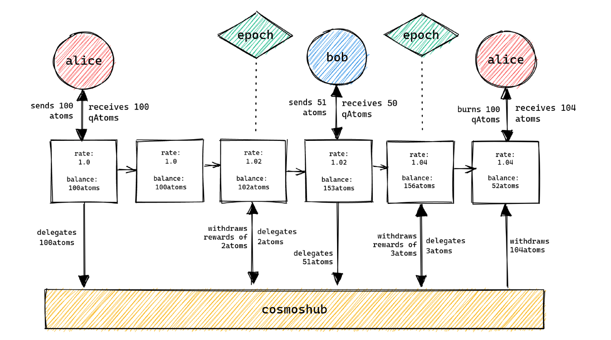

# Quicksilver

<figure><figcaption></figcaption></figure>

One of the shortcomings of classic staking is the unbonding period, associated with the time when assets are locked on the native chain.&#x20;

It is expected that liquid staking will improve the capital efficiency so much that derivatives (liquid staking assets) become the prevailing transactional medium. Particularly for use-cases exogenous to the originating chain. Details on this concept are described in the [Cosmos Hub Vision](https://gateway.pinata.cloud/ipfs/QmWXkzM74FCiERdZ1WrU33cqdStUK9dz1A8oEvYcnBAHeo) dated 26.09.2022.

A deeper insight into liquid staking can be gained by reading, for example, this [overview](https://mirror.chorus.one/liquid-staking-report.pdf). &#x20;

### How does it work

The main functionality of Quicksilver is to allow users to transfer their assets to a network X, such that it is controlled by the Quicksilver Protocol, and in return, issue qAsset (derivative) tokens that represent that position.&#x20;

Derivative is an agreement or contract between two parties to undertake to perform certain actions with respect to the underlying asset.

The qAsset tokens represent the user’s claim to their original native assets. Derivatives are burned at the point of buyback.

The interchain module for each onboarded chain will generate and control a deposit account by the Interchain Accounts IBC module.

The purpose of the deposit account is to receive the transfer of delegated positions that have been tokenized using the liquid staking module (LMS). After receiving a transfer in the deposit account, the corresponding address on the Quicksilver chain will be credited with the appropriate qAsset, a derivative of the original asset.&#x20;

Then the delegation shares are transferred to one or more delegation buckets. At the end of each epoch (which is lasting 3 days), each delegation bucket restakes the acquired rewards. Thus, at each epoch, the redemption rate for the Asset:qAsset pair will be adjusted in view of rewards.

The diagram shows that Alice delegated 100 ATOM, and withdrew 104 ATOM, while Bob got his qATOM with a rate of 1.02.

<figure><figcaption></figcaption></figure>

Additionally, each epoch a rebalance of funds among delegation buckets will be accrued, with due consideration for delegators’ wishes and in order to facilitate the participation in proxy governance.

### Equalization of Redemption Rate&#x20;

Since validators are free to choose their own commission rates, a delegation to validator A does not provide the same rewards over the period as an equal delegation to validator B.

In order to ensure fungibility between validators, we should treat all delegations as equal.&#x20;

Therefore, the collective Asset/qAsset redemption rate will increase, regardless of the validators with whom you choose to delegate.

### Signalling Intent

When a delegator transfers their delegation to Quicksilver for the first time, the reference point ‘signal’ is formed. This signal can change the volume of staked assets at any point, and then the MsgSignalIntent transaction reflecting the user’s desire will be formed.

<figure><figcaption></figcaption></figure>

Alice and Bob both deposited 150 ATOM to get 150 qATOM. Both parties delegated 150 ATOM in equal proportions 50/50/50 (or 1:1:1) between A, B, and C validator. Bob made a decision to no longer delegate to the B validator. If so, the weight would look like this: А:1, В:0, С1. Bob's staked assets will be distributed in the following way - 75/0/75.

In the following epoch an [aggregate weight](https://context.reverso.net/%D0%BF%D0%B5%D1%80%D0%B5%D0%B2%D0%BE%D0%B4/%D0%B0%D0%BD%D0%B3%D0%BB%D0%B8%D0%B9%D1%81%D0%BA%D0%B8%D0%B9-%D1%80%D1%83%D1%81%D1%81%D0%BA%D0%B8%D0%B9/aggregate+weighted) will change (2,5 : 1 : 2,5), so redelegations are issued on Cosmos Hub to move 25 tokens to B and 25 tokes to C.

<figure><figcaption></figcaption></figure>

### Risk Socialization and Slashing

Similar to Reward Socialization, given that validators are independent, run different hardware and software configurations and are run by different teams with different experience and priorities, the risk profile of each validator is different. To maintain fungibility, this risk must also be socialized. Thus, an event associated with decline of the assets' value for one validator, borne by all qAsset holders through a negative movement in the Asset:qAsset redemption rate.&#x20;

With sufficient decentralization, slashing events are hedged. For instance, a double-sign slash (5%) for an average (1% of managed supply) validator, will lead to a 0.05% reduction in the redemption rate. An event when a validator being jailed for downtime (0.1%), will lead to a 0.001% reduction in the rate.

In addition, when a validator is being jailed for a double-sign infraction, the protocol will (insofar as redelegation limitations permit) move the delegation to the validator that replaces it in the active validator set.\

### Governance by Proxy

Another important feature of Quicksilver is the ability for qAsset holders to continue to participate in governance as if they were delegating natively, for example, in Cosmos Hub. The Quicksilver protocol will monitor governance proposals submitted on connected chains and mirror the vote on the Quicksilver zone to permit qAsset holders to submit their vote. Voting on Quicksilver ends for a certain period  before  the end of the voting on the target zone, and Quicksilver submits transactions to reflect the intent of the qAsset holders on behalf of the delegation buckets. This allows the protocol to confer governance rights to users to within a small percentage of the cast vote. Users that do not participate in governance inherit the vote of their validators.

### Unrestricted Validator Sets

By default, the Quicksilver protocol will allow delegators to delegate to any of the validators in the native chain. However, QCK holders can deny some validators a place on the list. For instance, if they decide to remove validators run by CEX or those who exhibiting behavior considered harmful to the network.&#x20;

### Participation Rewards

Participation rewards associated with the QCK tokens emission. Stakers, who prefer to delegate to the smaller and efficient validators, deeply involved in governance, will be rewarded in each epoch.&#x20;

Therefore, the Quicksilver team is looking to stimulate more even allocation of assets between validators. When assets are more evenly allocated between networks' validators, networks are less vulnerable to different kinds of attacks and acts of censorship. The team is also looking to support the decentralization in the ecosystem by rewarding those who delegate the authorities to the smaller validators.

### The Allocation of Delegations

Among other things, the Quicksilver's interface will allow users to allocate the delegations between multiple validators (up to 8). It is expected that this would have a positive impact on decentralization.

### &#x20;Quicksilver Token (QCK)

The QCK token is used to:&#x20;

* Governance
* Security&#x20;
* Fee payments&#x20;

**Governance**&#x20;

Governance is understood as onboarding of new zones and corresponding incentivisation, spendings, controlled by community, changing of network parameters, and control of the upgrade process. All these events are handled by the governance process. &#x20;

**Security**&#x20;

Initially it was assumed that Quicksilver would utilize Interchain Security. In this case the QCK token will be used as payment to a validator set for the provision of security.&#x20;

Though the ISC development has not come to the required level, so Quicksilver intends to supplement this system with its own validator set.&#x20;

**Fee payment**&#x20;

The QCK token is also used to pay transaction fees. These fees are paid to block producers as a compensation for ensuring transactions are included in blocks. All the income obtained by the protocol is distributed among the QCK stakers.

### Tokenomics

The QCK token will experience yearly inflation until it reaches a maximum supply of 720 million.&#x20;

Inflation in the first year will be 65% and then will drop by 25% every year. Though, inflation can be changed by voting.&#x20;

The tokens will be allocated as follows:

<figure><figcaption></figcaption></figure>

This allocation can be changed at the discretion of the QCK token holders through a governance proposal.

### Genesis Token Allocation

The initial token allocation of the Quicksilver native token, QCK, will be 200 million.

It will be allocated as follows:

<figure><figcaption></figcaption></figure>

Earlier there was information about vesting for founders and investors, but this information is removed from the current tokenomics.

Investors and partners - Figment Capital, Strangelove Ventures, Zero Knowledge Validator, Interop Ventures, Iqlusion, Ki Foundation, Cerulean Ventures, Chorus One, 01node и Moonlet.

### Links

Twitter: [https://twitter.com/quicksilverzone](https://twitter.com/quicksilverzone)

Telegram: [https://t.me/quicksilverzone](https://t.me/quicksilverzone)

Discord: [https://discord.gg/kTsQAZmmzZ](https://discord.gg/kTsQAZmmzZ)

Website: [https://quicksilver.zone](https://quicksilver.zone/)

Whitepaper: [https://quicksilver.zone/whitepaper.pdf](https://quicksilver.zone/whitepaper.pdf)

Official Docs: [https://docs.quicksilver.zone/](https://docs.quicksilver.zone/)
