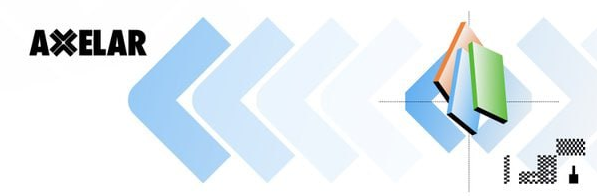

# Um

<figure><figcaption></figcaption></figure>

**Umee** __ is a Cosmos-based [decentralized finance](https://umeeversity.umee.cc/learn-the-basics/defi-basics/what-is-defi) hub supporting a suite of composable debt primitives that will enable the next generation of global debt markets. As a [base layer blockchain](https://umeeversity.umee.cc/learn-the-basics/blockchain-basics/what-is-blockchain), applications and money lego primitives can be built on top of Umee to access cross chain leverage and liquidity. The Umee Blockchain facilitates interoperability between the [Cosmos ecosystem](https://umeeversity.umee.cc/learn-the-basics/cosmos-basics/what-is-cosmos), Ethereum network, side chain architectures, layer two scaling solutions, and alternative base layer protocols.

### Foundations and partners 

<figure><figcaption></figcaption></figure>

Umee raised $18M at $0.0048 from funds.\
The first round on Coinlist raised $18M at $0.06 and the second round raised $14M at $0.07.\
The total investment in the project is $50M.

Among the funds worth mentioning are Polychain Capital, Coinbase Ventures, Alameda Research, Consensys Ethereal Ventures.\
Some of the investors can be classified as ecosystem investors, which is not bad at all.

### Issues with Legacy Debt Markets: 

_**Problem**_\
_Billions of people around the world are unable to access debt markets as they do not meet the required profiles that the debt markets define as desirable business and thus are barred from accessing the biggest capital market in the world. Various new forms of debt platforms (e.g. peer-to-peer lending and social impacting investments) have emerged, but they suffer from very limited impact._

_**Solution**_

_As a base layer blockchain secured by a decentralized_ [_validator_](https://umeeversity.umee.cc/learn-the-basics/staking-basics/what-is-validator) _set, anyone with an internet connection is able to access Umee's services. Umee is permissionless, meaning anyone can access debt markets on Umee regardless of things like their location or financial history._

_**Problem**_

_Legacy debt markets give participants little to no visibility on their processes. Major participants have shown they are willing to act recklessly with clients' funds (toxic lending, over-leveraging, etc.) while disclosing minimal details to clients. Not everyone has to play by the same rules and asymmetric information access gives the lending institutes unfair advantage and power in the market._

_**Solution**_\
_As a public blockchain Umee operates transparently, making it easier for Umee users to assess risks. The same rules apply to all market participants on Umee, regardless of their individual circumstances._

_All Umee users must be properly over-collateralized at all times in order to borrow funds. Users who fail to remain properly over-collateralized will have their collateral_ [_liquidated_](https://umeeversity.umee.cc/learn-the-basics/umee-basics/common-terms.html#liquidation) _in order to minimize risks of insolvency and provide a high degree of security to lenders._

_**Problem**_

_There is often a conflict of interest between clients who provide liquidity and the agents who act on their behalf. The client maintains ownership of the assets provided, and takes the risk of potential losses. Agents are generally incentivized to do whatever it takes to boost their commission or other form of personal gains with minimal to zero personal liability; this lack of proper alignment often results in decisions that are harmful for the client._

_**Solution**_\
_Umee will be owned and_ [_governed_](https://umeeversity.umee.cc/governance) _by its users and contributors. Umee's on-chain_ [_governance structure_](https://umeeversity.umee.cc/governance/governance-overview) _can help align interests between different stakeholder groups._

### **Vision Umee** 

**U**_**mee**_ is the first borrowing and lending platform aimed at offering universal cross-chain DeFi functionality that combines the strengths of blockchain architecture with the fundamentals of traditional debt markets. Umee will replicate the $200 trillion global debt capital markets using open source code, crypto primitives and web3 technology, constructing a universal yield curve and enabling a foundation for a modern monetary policy that is globally unified, transparent and decentralized.

#### **Foundation of a Web3 Native Debt Market**

Umee combines traditional debt market fundamentals with the next generation capabilities of [blockchain technology](https://umeeversity.umee.cc/learn-the-basics/blockchain-basics/what-is-blockchain).

_Traditional debt market fundamentals will provide Umee with the basis to create:_

* _A term structure that uses time-to-maturity and credit-worthiness to determine rates;_
* _The crypto format for debt primitives such as notes, bills, bonds, CDS, structured products, and other assets._

<figure><figcaption></figcaption></figure>

#### A Suite of Products and Features for Optimal Performance 

In building the next generation of global debt markets, Umee will integrate a variety of key technologies to offer scalability, interoperability, and privacy.

_Umee will be able to provide users with:_

* _**Scalability** via_ [_Cosmos’_](https://umeeversity.umee.cc/learn-the-basics/cosmos-basics/what-is-cosmos) _CosmWasm and shared security to accommodate the entire volume of global debt markets;_
* _**Interoperability** and_ [_interchain accounts_](https://umeeversity.umee.cc/learn-the-basics/cosmos-basics/interchain-accounts) _via_ [_IBC_](https://umeeversity.umee.cc/learn-the-basics/cosmos-basics/what-is-ibc) _to remove the silos between ecosystems to enable maximum liquidity in a universal market;_
* _**Privacy** via ZK based technologies to grant participants with full control over their information that is shared across the network, and accommodate sensitive transactions currently confined to centralized resources._

There are certain industry standards in place to help protect users, including the extensive auditing of code to find any potential weaknesses before a product is launched and any real money is at stake. Security is a priority for Umee, which is why Umee has contracted several top auditors to inspect every line of code and flag any potential vulnerabilities before going live.

<figure><figcaption></figcaption></figure>

### **Gravity Bridge** 

What is Gravity Bridge?\
Umee’s Gravity Bridge is a chain-specific bridge optimized for transfers between Ethereum and the Umee blockchain, with plans to integrate an Omni-EVM feature (includes the ability to transfer to and from multiple EVMs) in the future. The advantages Umee’s gravity bridge affords over generalized bridges is security and capital efficiency. The bridge’s multisig which signs off on state changes (account balances) for cross chain transactions is controlled by Umee’s 100 decentralized and permissionless validators, greatly enhancing security and minimizing trust assumptions. In this documentation we dive further into the economics of Gravity Bridge and Peggo, which is an orchestrator for the Gravity Bridge that assists relayers in cross-chain messaging.

#### Umee's Gravity Bridge Solution 

Umee utilizes Gravity Bridge as a module and developed its own relayer written in Go called Peggo. The primary goal of Peggo is to act as a relayer that is compatible with any network using Gravity Bridge. The Gravity contract (deployed on Ethereum) is trustless and acts as a self-updating multisignature wallet that is controlled by the validator set. Everytime the power of Umee’s validators change, a new “valset update” is created and signed. This update is then sent to Ethereum via any participant in the network. Providing this update to Ethereum is incentivised by monetary rewards, there exists no pre-selection of who relays the message to Ethereum.

#### Functions 

The main function of Gravity Bridge is to securely transfer ERC-20 assets to Cosmos, and vice versa. The key stakeholders of Gravity Bridge are the users, relayers, and validators. Validators are the same actors that secure the Umee blockchain. In order for validators to relay transactions, they must run a software on their nodes called Peggo, which is the orchestrator that allows them to validate events (changes in account balances) occurring on both Ethereum and Cosmos. All of Umee’s 100 validators must sign-off on the multisig for Gravity Bridge via Peggo, making the bridge decentralized and robust in its security setup.

#### Ethereum to Cosmos 

<figure><figcaption></figcaption></figure>

When a user sends a token from Ethereum to Cosmos, funds are deposited in the gravity smart contract on Ethereum and an event is created. This event will be picked up by validators (using Peggo) and relayed to the Umee blockchain. Once >66% of the validators have claimed to see the event, the according tokens bridged from this transaction will be unlocked and sent to the destination address on Umee.

#### Cosmos to Ethereum 

<figure><figcaption></figcaption></figure>

For transactions from Cosmos to Ethereum, the Gravity contract creates ERC-20 representations for Cosmos tokens and ERC20 tokens that were previously locked in the Gravity contract will be freed and sent to the destination address. Umee will collect transactions into batches, ordered by fee, which then will be signed by validators. Once enough signatures are collected (>66% of validators), this most profitable batch can be relayed to Ethereum by any participant of the network to get the relaying reward (the sum of all fees). Bridge fees are always paid in the same token that is being sent, so there’s no need to buy the Umee token to be able to use the bridge (only a tiny bit to pay for Umee blockchain’s fees which are negligible and easily bought on a Dex such as Osmosis).

The transaction fees on Ethereum are exponentially higher than fees on a Cosmos SDK chain. In order to reduce bridge cost which is associated with the fees charged by the destination chain (Ethereum in this case), transactions being sent from Cosmos to Ethereum are put into batches before they are sent to Ethereum. When sending tokens from Cosmos to an Ethereum address, the tokens are first sent to the Gravity contract and sit in the mempool of unconfirmed transactions. As soon as a threshold of transaction fees is reached after pooling the pending transactions, they are batched and relayed to Ethereum. All the remaining pending transactions will wait in the mempool until the threshold of transaction fees is reached again. Batching transactions helps reduce the high cost of processing transactions on Ethereum by splitting the cost up between a batch.

#### Peggo 

What is Peggo?

Simply put, Gravity Bridge would not be able to operate effectively without the help of Peggo. This is due to the fact that The Gravity Bridge needs an orchestrator (Peggo), to relay events from one chain to the other. The easiest way to understand Peggo is to imagine it as a Go (programming language) implementation of Gravity Bridge. Peggo watches for events that occur on both the Ethereum and Cosmos blockchains. When Peggo notices an event on either blockchain, it notifies the corresponding blockchain accordingly.

An orchestrator is a program that runs on every validator in order to assist the Gravity Bridge module. Orchestrators help the Cosmos code perform tasks such as sign messages or transactions using a validator’s unique key.

### Umee Relayers 

#### Relayer Responsibility 

The Umee validators usually take the role of the relayers. As a requirement, validators must validate and sign transactions in order for relaying transactions to reach consensus; not participating as an orchestrator will cause them to be slashed. Validators are not required to participate in the relaying work and instead can assign a third party to run Peggo.

As part of the security mechanism of Gravity Bridge, there are punishments if a relayer fails to take a required action, produce an incorrect message, or takes malicious behavior. Relayers will risk being slashed or kicked out of the Gravity Bridge validator set.

#### Relayer Incentivization 

Relayers earn fees for their work in facilitating relaying transactions. Relayers compete in being the first in relaying profitable transactions or batches to earn the relaying fees. Whoever submits the batch to Ethereum first will earn all of the fees. The other relayers who fail to submit the transaction batch in time will still spend their ETH for the failed transaction attempt. For this reason, relayers have the incentive to be the fastest in relaying profitable transactions. In order to increase the odds of success, relayers are free to modify Peggo for the best performance possible.

Relayers are able to adjust their profit margin requirement to conduct a relay by setting their own profitability multiplier. The profitability multiplier ultimately determines how much they earn from a successful relay. A batch is only created once the total transaction fees in the mempool reach the profitability threshold. Relayers do not choose how a batch is formed or what transactions are included.

#### Relaying Costs 

Users pay a gas fee using Umee (for the transaction) in addition to a bridge fee. It’s important to note that the bridge fee is paid in the token that is being sent. On the other hand, relayers must pay an Ethereum gas fee (regardless of if their relay was successful). Relayers must pay the Ethereum gas fee using ETH however they will get their reward in the batch’s denom token. This is the primary factor that influences the profit margin (if any) of a relay.\
The Umee blockchain could produce a list of batches, however it is up to the relayers to weigh gas costs vs potential rewards from relaying a batch. The relayer must perform a check on each batch in order to decide whether they should relay. Relayers relay all batches that are deemed profitable. To achieve this, relayers will query from the Umee blockchain the list of batches and will navigate through each one.

At each batch in the list relayers will check for the following:

* If the batch has enough signatures or not;
* Simulate the ETH transaction to get a gas cost estimate, then convert that to its USD equivalent;
* Convert the batches fees to USD;
* Check if the batch is profitable using the following condition: _totalFee >= (gasCost \* profitMultiplier)_. If this condition is true, then the relayer will send the ETH transaction.

### Team 

<figure><figcaption></figcaption></figure>

### Token 

#### **Utility** 

**Validator Infrastructure**

The Umee Blockchain is built on a network of validators that contribute Tendermint BFT consensus to the protocol. Tokens are bonded to validators that stake to provide Proof of Stake consensus to the network. Validators come from an open ecosystem of contributors and infrastructure providers. Tokens can also be delegated to validators by users to participate in the underlying consensus mechanism. This helps ensure the Umee network remains decentralized.

[Learn more about staking here](https://umeeversity.umee.cc/learn-the-basics/staking-basics/what-is-staking). [Learn how to stake UMEE tokens here](https://umeeversity.umee.cc/users/staking-umee/staking-umee).

#### **Network Fees**

Network fees will be earned in the form of UMEE tokens by validator infrastructure providers.

> Similar to how ETH is used as a gas fee to pay for transactions on the Ethereum blockchain, UMEE is used as a gas fee to pay for transactions on the Umee Blockchain.

Validators earn block rewards in the form of UMEE similar to how transaction fees are processed in native blockchain protocols.

#### **Protocol Governance**

The native UMEE token is also a protocol governance token used to facilitate on-chain governance for the Umee Blockchain. The UMEE token, when staked, can be used to vote on protocol parameters and upgrades for improving functionality of the blockchain infrastructure. The UMEE token will also govern DeFi parameters of applications that sit on top, community grants, and future development.

> [Learn how to vote on an Umee governance proposal here](https://umeeversity.umee.cc/users/governance/voting).

> [Learn how to create an Umee governance proposal here](https://umeeversity.umee.cc/users/governance/creating-proposal).

> [Join the governance conversation hereopen in new window](https://gov.umee.cc/).

Different blockchains typically use different versions of tokens. Most tokens can be used across blockchains if converted to the correct format. It’s important to know which type of tokens you are in possession of before interacting with any web3 applications.

<figure><figcaption></figcaption></figure>

The UMEE token exists in two forms: a Cosmos native version (the native UMEE token) and an ERC-20 token version native to Ethereum. The two forms of UMEE tokens can be freely [converted to one another](https://umeeversity.umee.cc/users/using-the-web-app/transferring-tokens).

#### Native UMEE Tokens 

Most Cosmos tokens like the native UMEE token are interoperable with other Cosmos blockchains by design. Cosmos ecosystem users can easily transfer tokens between chains in a fast and trustless manner.

_**The main purpose of the native UMEE token** is to participate in the PoS consensus mechanism to help secure the Umee blockchain and earn PoS staking yield, pay gas fees on the Umee blockchain to execute Umee’s cross chain DeFi transactions, and to be able to vote and participate in protocol governance decisions._

**You are in possession of the **_**native UMEE token**_ native to the Umee blockchain if any of the following are true:

* Your tokens are stored in an Umee blockchain compatible wallet like Keplr.
* You purchased UMEE on a Cosmos-based decentralized exchange.
* You bridged UMEE from Ethereum to the Umee blockchain.

<figure><figcaption></figcaption></figure>

#### ERC-20 UMEE Tokens 

ERC-20 tokens are not compatible with Cosmos blockchains unless converted to a Cosmos native format. Similarly, native Cosmos tokens are not compatible with Ethereum blockchains unless converted to an ERC-20 format.

_**The main purpose of the ERC-20 UMEE token** is to create a user-friendly experience for Umee to tap into the DeFi legos on Ethereum and allow people to seamlessly access the UMEE token as an ERC-20 token and hold or trade it on centralized exchanges._

**You are in possession of the **_**ERC-20 UMEE token**_ native to the Ethereum blockchain if any of the following are true:

* Your tokens are stored in an Ethereum wallet like MetaMask.
* You purchased UMEE on an Ethereum-based decentralized exchange.
* You bridged UMEE from the Umee blockchain to Ethereum.

[Follow this guide](https://umeeversity.umee.cc/users/getting-started/funding-wallet) to obtain native UMEE tokens.

[Follow this guide](https://umeeversity.umee.cc/users/using-the-web-app/transferring-tokens.html#ethereum-to-umee-transfers) to convert ERC-20 UMEE to native UMEE tokens.

### Tokenomics 

**UMEE** is the Umee blockchain’s native token. The main purpose of the UMEE token is to power the PoS consensus of the Umee blockchain while allowing the community to use and govern Umee and the applications built on top.

#### Supply 

There is a total supply of **10 billion** UMEE tokens, uncapped, with an inflation and deflation mechanism in place to align the UMEE token distribution with long term Umee supporters over time.

#### Inflation 

Umee's inflation schedule changes slowly based on a targeted staking participation rate. When the network reaches the targeted staking rate, the inflation rate will remain constant. When the network has more than the targeted staking rate, the inflation rate will decrease gradually until reaching **7%**, the floor inflation rate. When the network has less staked, the inflation rate will increase gradually until reaching **14%**, the ceiling inflation rate.

> The dynamic inflation rate and the staking mechanism of the Umee blockchain is the ultimate security mechanism that guarantees the security of the Umee network.

#### Deflation 

Of the platform fees generated by the initial borrowing and lending functionality, [community governance](https://umeeversity.umee.cc/users/governance/voting) can make decisions regarding buybacks and burns of UMEE tokens. Additional deflation of the token supply will occur via governance determined mechanisms.

In the future community governance can also make decisions related to the usage of the Community and Ecosystem portions of the tokens, such as additional burning mechanisms and plans for the Community and Ecosystem tokens, based on the future market practice and industry trends for the best long term development of Umee.

### Distribution & release shedule 

<figure><figcaption></figcaption></figure>

<figure><figcaption></figcaption></figure>

#### Community 

**46%** of the genesis supply is reserved for the community. Umee community governance will determine how and when to distribute these tokens through various incentive and grant programs. DAOs can be set up through community votes in order to effectively lead and reward efforts of building sustainable value. All types of contributors can be eligible for community token incentives, including but not limited to technical contributors, community builders, educators, and liquidity providers.

_**7%** of the Community tokens are liquid at the TGE on or around February 15th, 2022; the majority of it is structured as a loan to the market makers of the UMEE tokens, and the rest will be distributed as community incentives to bootstrap the Umee network. The remaining **39%** of the tokens will be vested linearly for six years starting at the TGE._

#### Ecosystem 

**9%** of the genesis supply is allocated for the ecosystem. Umee community governance will decide how to use these tokens to best incentivize developers to build on top of the Umee blockchain and further build out the ecosystem. These tokens may also be burned if the community chooses to do so.

_These tokens will be vested linearly for eight years starting at the TGE on or around February 15th, 2022._

#### Public Round 

**5%** of the genesis supply goes to community members who participated in Umee’s public sale on Coinlist.

_These tokens will be vested linearly for eight to ten months depending on the sale option selected, starting at the TGE on or around February 15th, 2022._

#### Private Rounds 

**14%** of the genesis supply is allocated to early investors who participated in one of Umee’s two private rounds.

_These tokens are subject to a six month cliff which will begin at the TGE on or around February 15th, 2022. After six months, **1%** of these tokens will be vested linearly for six months while the remaining **13%** will be vested linearly for eighteen months._

#### Team 

**15%** of the genesis supply is reserved for the Umee team. These tokens will be used to help attract new talent and reward Umee team members for their work. The goal of the Umee team is to attract and collaborate with the best talents and teams around the globe. A portion of the team tokens are set aside for ongoing grants to support the development of Umee as well as open source components of the Umee ecosystem.

_These tokens are subject to a six month cliff which will begin at the TGE on or around February 15th, 2022. After six months, these tokens will be vested linearly for thirty months._

#### **Umee Labs** 

**10%** of the genesis supply is allocated to Umee Labs, the corporate entity that funded the development of the Umee protocol and is owned by the founding team. In order to best align the long term interest of the Umee community and not receive tokens in advance of any other Umee participants, the entity has an eight year lockup schedule, beginning with a twelve month cliff.

_These tokens are subject to a twelve month cliff which will begin at the TGE on or around February 15th, 2022. After twelve months, these tokens will be vested linearly for eighty-four months._

#### **Advisors** 

**1%** of the genesis supply goes to advisors who have tremendously helped and continue to help guide Umee along its journey.

_These tokens are subject to a six month cliff which will begin at the TGE on or around February 15th, 2022. After six months, these tokens will be vested linearly for 30 months._

Vesting schedule [here](https://vestlab.io/umee).

### **Links:** 

[Twitter](https://twitter.com/Umee\_CrossChain)

[Youtube](https://www.youtube.com/channel/UCNNeflvj43QylhjvssqdIHQ/videos)

[Discord](https://discord.com/invite/umee)

[Reddit](https://www.reddit.com/r/UmeeCrossChain/)

[Telegram](https://t.me/umeecrosschain)

[Medium](https://medium.com/umeeblog)
